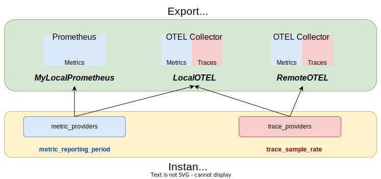

# KrakenD OpenTelemetry (`krakend-otel`)
OpenTelemetry building blocks to instrument [KrakenD](https://www.krakend.io) and [Lura](https://luraproject.org/) based API Gateways.

[Apache License 2.0](.LICENSE)

**Documentation**:

- [OpenTelemetry configuration](https://www.krakend.io/docs/telemetry/opentelemetry/)
- [OpenTelemetry layers, traces, and metrics](https://www.krakend.io/docs/telemetry/opentelemetry-layers-metrics/)

## Example

For a quick look at the observability the library can provide, check the
[example documentation](./example/README.md).

## Configuration from Lura's [ServiceConfig](https://github.com/luraproject/lura/blob/master/config/config.go)

In order to configure the open telemetry stack to instrument the API Gateway, a
new entry must be added to the `ExtraConfig` root propertry of `ServiceConfig`
using the `telemetry/opentelemetry` key, with the `krakend-otel`'s configuration.

See the [configuration](https://www.krakend.io/docs/telemetry/opentelemetry/) of the component.

In a visual way, this is the relation between the `exporters` configuration, and
how we select as `metric_providers` or `trace_providers`:

### Layers, Traces and Metrics
The most up to date documentation about the different supported layers, and the produced metrics and traces is available in the [Understanding OpenTelemetry layers and metrics](https://www.krakend.io/docs/telemetry/opentelemetry-layers-metrics/) documentation.

We can differentiate the processing of a request in KrakenD in 3 main stages (each one
including or wrapping the inner stage):

- `global`: this part that comes before the `Lura`'s framework starts working with
    the request. In the case of [KrakenD CE](https://github.com/krakend/krakend-ce),
    this stage is implemented using [gin](https://github.com/gin-gonic/gin). See the [Data exposed in the global layer](https://www.krakend.io/docs/telemetry/opentelemetry-layers-metrics/#data-exposed-in-the-global-layer) and [its configuration options](https://www.krakend.io/docs/telemetry/opentelemetry/#global)

- `proxy`: this is the `Lura`'s framework part where it deals with one of the
    API Gateway exposed endpoints, and includes spawning the required
    requests to the backends, as well as the manipulation at the endpoint
    level before and after the requests are performed. See the [Data exposed in the proxy layer](https://www.krakend.io/docs/telemetry/opentelemetry-layers-metrics/#data-exposed-in-the-proxy-layer) and [its configuration options](https://www.krakend.io/docs/telemetry/opentelemetry/#proxy)

- `backend`: this is the `Lura`'s framework part where it deals with each
    single backend request (including the manipulation at that request level). See the [Data exposed in the backend layer](https://www.krakend.io/docs/telemetry/opentelemetry-layers-metrics/#data-exposed-in-the-global-layer) and [its configuration options](https://www.krakend.io/docs/telemetry/opentelemetry/#backend)

# Additional information

- Check the [example documentation](./example/README.md)
- Some [notes about current implementation](./doc/implementation_details.md)
