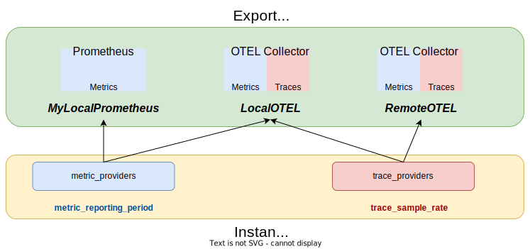

# krakend-otel

OpenTelemetry building blocks to instrument [Lura](https://github.com/luraproject/lura) / [KrakenD](https://krakend.io) 
based API Gateways.

[Apache Licnese 2.0](.LICENSE)

## Example

For a quick look at the observability the library can provide, check the 
[example documentation](./example/README.md).

## Configuration from Lura's [ServiceConfig](https://github.com/luraproject/lura/blob/master/config/config.go)

In order to configure the open telemetry stack to instrument the API Gateway, a 
new entry must be added to the `ExtraConfig` root propertry of `ServiceConfig` 
using the `telemetry/opentelemery` key, with the `krakend-otel`'s configuration.

## `krakend-otel` Configuration

In the configuration we find the following root entries:

- `service_name`: to provide a custom name for this service. However if there is 
  a `ServiceConfig.Name` already set, that will be the one used.
- `exporters`: in this section we map our own "custom names" for different 
  exporters configurations. This allows us to use the same `kind` of exporter,
  with different port / host configurations, and report the same metric / traces
  to different systems (imagine migrating from a self hosted grafana stack to the
  cloud version, and that for a while you want to report to both places before
  making the switch), of report to different `kind` of exporters (migrating from one cloud 
  observability system to a different one).
- `layers`: in this section we can fine tune the amount of metrics / traces that 
  we want to report at each "stage" of the processing pipeline: `router`, `pipe` or `backend`.
- `metric_providers`: this is the list of the exporter names that we want to use to 
  report metrics. Provides an easy way to just select a few of the configured exporters
  for metrics (the exporters might have support for metrics **and / or** traces, so
  that should be taken into account because if we try to use an exporter that 
  does not have support for metrics, it will fail).
- `metric_reporting_period`: how often we want to flush the metrics in seconds.
- `trace_providers`: the list of the exporter names that we want to use to
  report traces. Provides an easy way to just select a few of the configured exporters
  for traces (the exporters might have support for metrics **and / or** traces, so
  that should be taken into account because if we try to use an exporter that 
  does not have support for traces, it will fail).
- `trace_sample_rate`: a number between `0` and `1.0` to define the sample rate for 
  traces: if we set it for example to `0.25` only one in four requests will be 
  reporting traces (usefull to reduce the amount of data generated while keeping
  some traces to identify / debug issues).
- `extra`: we leave this entry for any other "custom configuration" that a user of this 
  library might want to add.

In a visual way, this is the realation between the `exporters` configuration, and 
how we select as `metric_providers` or `trace_providers`: 



### Layers

We can differentiate the processing of a request in KrakenD in 3 main stages:

- `router`: the part that comes before the `Lura`'s framework starts working with
    the request. In the case of [KrakenD CE](https://github.com/krakend/krakend-ce),
    this stage is implemented usin [gin](https://github.com/gin-gonic/gin)

- `pipe`: this is the `Lura`'s framework part where it deals with one of the
    API Gateway exposed endpoints, and includes spawning the required 
    requests to the backends, as well as the manipulation at the endpoint
    level before and after the requests are performed.
    
- `backend`: this is the `Lura`'s framework part where it deals with each
    single backend request (including the manipulation at that request level).
    
    
For each of those layers it can be selected the deatail of metrics and traces
that we want to report.

#### router

At the router level we have 3 main options:

- `metrics`: boolean to enable / disable if we want to report metrics for this layer
- `traces`: boolean to enable / disable if we want to report traces for this layer
- `disable_propagation`: boolena to disable the consumption of a propagation header for
    traces (so spans from a previous layer are linked to the KrakenD trace).

```json
"router": {
    "metrics": true,
    "traces": true,
    "disable_propagation": false
}
```

#### pipe

At the pipe level we only have 2 options:

- `metrics`: boolean to enable / disable if we want to report metrics for this layer
- `traces`: boolean to enable / disable if we want to report traces for this layer

```json
"pipe": {
    "metrics": true,
    "traces": true
}
```

#### backend

At the backend level is where we have more granularity selecting the information
that we want to obtain.

There are three entries:

- `metrics`: to define the amount of info we want to report in backend metrics
- `traces`: to define the amount of info we want to report in backend traces
- `skip_paths`: an option to define backends that we do not want to instrument. By default,
    if it is not provided, it will skip the following "internal" paths:
		- `/healthz`
		- `/_ah/health`
		- `/__debug`
		- `/__echo`
    If we want to instrument those paths too, just provide an empty string as endpoint to
    skip.
  
For both, the `metrics` and `traces` part, we can select the same options:

- `stage`: to enable metrics / traces for the full backend processing part
- `round_trip`: to enable metrics /traces for the actual http request for the backend
  (not taking into account the manipulation part at the backend level).
- `read_payload`: to enable metrics / traces only for the response reading payload
  (not taking into account the http connection part of the request).
- `detailed_connection`: to enable metrics / traces for the connection details, like
  time to query the DNS, the time spent in TLS, and so one.
- `static_attributes`: a map of `key: value` pairs to be used as tags / labels in 
  the reported metric / traces.
  
```json
"backend": {
    "metrics": {
        "stage": true,
        "round_trip": true,
        "read_payload": true,
        "detailed_connection": true,
        "static_attributes": {
            "my_metric_attr": "my_middle_metric"
        }
    },
    "traces": {
        "stage": true,
        "round_trip": true,
        "read_payload": true,
        "detailed_connection": true,
        "static_attributes": {
            "my_trace_attr": "my_middle_trace" 
        }
    },
    "skip_paths": [""]
}
```


### Example configuration:

Putting it all together, here we have an example of a configuration:

```json
"telemetry/opentelemetry": {
    "service_name": "krakend_middle_service",
    "exporters": {
        "local_prometheus": {
            "kind": "prometheus",
            "config": {
                "port": 9092,
                "process_metrics": true,
                "go_metrics": true
            }
        },
        "local_tempo": {
            "kind": "opentelemetry",
            "config": {
                "port": 4317,
                "use_http": false
            }
        },
        "local_jaeger": {
            "kind": "opentelemetry",
            "config": {
                "port": 5317,
                "use_http": false
            }
        }
    },
    "layers": {
        "router": {
            "metrics": true,
            "traces": true,
            "disable_propagation": false
        },
        "pipe": {
            "metrics": true,
            "traces": true
        }, 
        "backend": {
            "metrics": {
                "stage": true,
                "round_trip": true,
                "read_payload": true,
                "detailed_connection": true,
                "static_attributes": {
                    "my_metric_attr": "my_middle_metric"
                }
            },
            "traces": {
                "stage": true,
                "round_trip": true,
                "read_payload": true,
                "detailed_connection": true,
                "static_attributes": {
                    "my_trace_attr": "my_middle_trace" 
                }
            },
            "skip_paths": [""]
        }
    },
    "metric_providers": [
        "local_prometheus"
    ],
    "metric_reporting_period": 1,
    "trace_providers": [
        "local_tempo",
        "local_jaeger"
    ],
    "trace_sample_rate": 1,
    "extra": {
        "custom": "extra",
        "future_expansion": true
    }
}
```

# Other Info

- Check the [example documentation](./example/README.md)
- Some [notes about current implementation](./doc/implementation_details.md)
